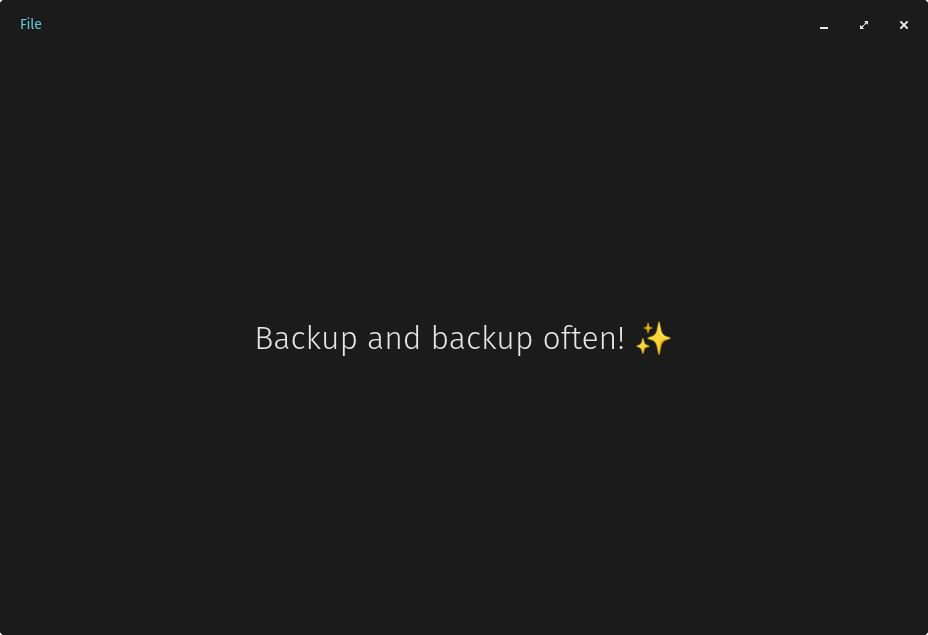

# COSMIC Backups


The current plan is to use Restic as the backend but for now the UI/UX is still being worked on. I have no idea if this will move forward past the init stage.



## Install

To install your COSMIC application, you will need [just](https://github.com/casey/just), if you're on Pop!\_OS, you can install it with the following command:

```sh
sudo apt install just
```

After you install it, you can run the following commands to build and install your application:

```sh
just build-release
sudo just install
```
